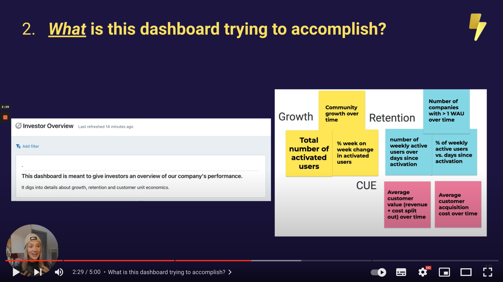

sidebar_position: 2
sidebar_label: Planning your dashboard: the Who, What and How of dashboard building.
---

# Planning your dashboard: the Who, What and How of building great dashboards.

For those of you who are just getting started with building dashboards, it it can be useful to do some planning before you get your hands dirty and actually start building the thing.  

So, we thought we'd give you a few tips to help you get comfortable with planning your dashboard build. Specifically, we're going to answer three questions before we build our dashboard: “who? what? and how?”

Check out our 5 minute video tutorial here:

## Before you start building your dashboard, you should be able to answer three questions:

1. [**_Who_ is this dashboard for?**](#who-is-this-dashboard-for)
2. [**_What_ is this dashboard trying to accomplish?**](#what-is-this-dashboard-trying-to-accomplish)
3. [**_How_ can I build this dashboard?**](#how-can-i-build-this-dashboard)

### 1. Who is this dashboard for?

- Does your audience already know what you're talking about?
- Do you need to add more context to help make your point?

**Actions**:
- Think about what context your audience will need and add this to your dashboard. For example, any acronyms that will need clarifying or if an increase in a number is a good or bad thing.

### 2. What is this dashboard trying to accomplish?

- Once your audience has seen the dashboard, do you want them to:
    1. take an **_action_**?
    2. **_know_** something they didn't know before?
- What information do they need to take an action/be informed?

**Actions:**
- Write out a clear summary of your dashboard's purpose (and add it to your dashboard's description!)
- Write an outline of the questions you want answered in your dashboard's tiles. Start thinking about the story you're trying to tell to your audience.

### 3. How can I build this dashboard?

- What data do I have?
- How can I use it to make my point?

**Actions:**
- Match datasets to the outline of questions you made in the step above.
- Think about which metrics + dimensions you'll use to make your points (and if these exist yet)
